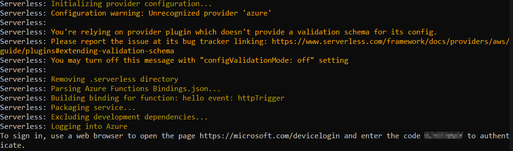
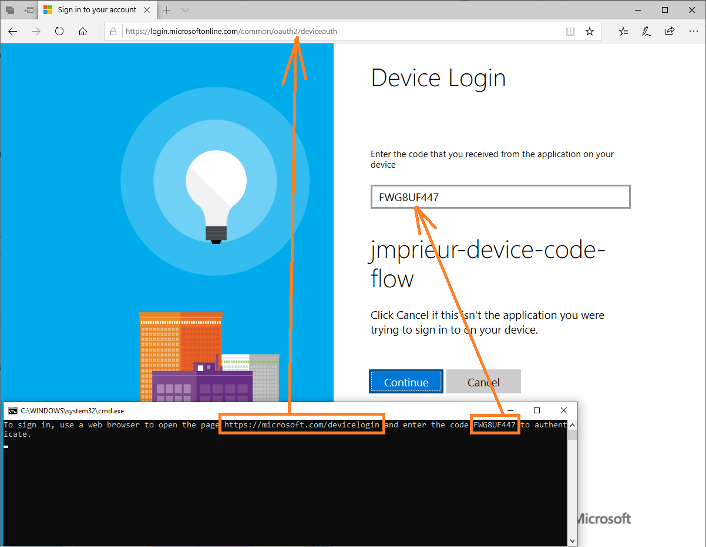

# Stateful Calculator Workshop

Welcome to this SOUTHWORKS Calculator with storage workshop! In this workshop, you will implement a
cloud-agnostic calculator with storage handler using the
[serverless multicloud framework](https://github.com/serverless/multicloud) that can be deployed to
more than one cloud provider. In this case, the handler will be deployed in both AWS and Azure cloud
providers.

You are going to deploy a basic calculator with storage that will allow only addition, subtraction,
multiplication, and division operations with the previus result from your session. As a result of
deploying you will get two endpoints, one from AWS and the other from Azure, to which you can make
requests by passing two operands and an operator in an object as parameters or with the sessionId,
an operand and an operator. As a result, each of the endpoints must return an object with the result
of having performed the mathematical operation and the sessionId on the result attribute of an
object.

<p align="center" width="100%">
     
</p>

This figure shows the architecture model of our Calculator with Storage API.

## Disclaimer

This workshop uses a new module we developed to support GCP as a cloud provider, if the [PR#83](https://github.com/serverless/multicloud/pull/83) is not merged yet, as a workaround, copy the [serverless-extension folder](../serverless-extension) into the [@multicloud framework](https://github.com/serverless/multicloud).
## Technologies

This workshop uses the following technologies.
| Technology                | Usage                                  |
|---------------------------|----------------------------------------|
|[Node.js](https://nodejs.org/)                    | Is a JavaScript runtime used in this sample and defined in the serverless template.|
|[Serverless](https://github.com/serverless)                 | The framework  used to deploy to the differents cloud provider using .yml files.|
|[Serverless multicloud](https://github.com/serverless/multicloud)     | A library that allow us to implement cloud provider agnostics handlers.|
|[Amazon Lambdas ](https://aws.amazon.com/es/lambda/features)            | The Amazon service where the functions will be deployed.|
|[Azure Functions](https://azure.microsoft.com/en-us/services/functions/)            | The Azure service where the functions will be deployed.|
|[Amazon S3 ](https://aws.amazon.com/free/storage/s3/)            | The Amazon service where the data will be saved.|
|[Azure Blob Storage](https://azure.microsoft.com/en-us/services/storage/blobs)            | The Azure service where the data will be saved.|
|[Azure PowerShell](https://docs.microsoft.com/en-us/powershell/azure/)                    | Azure PowerShell is a set of cmdlets for managing Azure resources directly from the PowerShell command line.|                                          |

## Prerequisites

You will need to have AWS, Azure, Google Cloud credentials and their respective levels of privileges to deploy the handler on those clouds.

Also, for the deploy to google you have to enable the following apis on your Google Cloud project.
* [Cloud Deployment Manager v2](https://console.developers.google.com/apis/api/deploymentmanager.googleapis.com/)
* [Cloud Functions](https://console.developers.google.com/apis/api/cloudfunctions.googleapis.com)
* [Cloud Build](https://console.developers.google.com/apis/api/cloudbuild.googleapis.com)

## Installation

### Installing Node.js

Download and install [Node.js](https://nodejs.org/)

### Installing serverless

```bash
npm install -g serverless
```
### Installing dependencies
```bash
npm install
```
### Installing Az module from the PSGallery repository

In order to install the Az module you have to run the following command on a Powershell console as administrator.

```bash
Install-Module -Name Az -Repository PSGallery -Force
```

Select Y to install and wait a few minutes until it´s installed.


### Setting up AWS

To run serverless commands that will interface with your AWS account, you will need to setup your
AWS account credentials on your machine following the
[AWS configure guide](https://docs.aws.amazon.com/cli/latest/userguide/cli-configure-quickstart.html).
You will need to have installed
[AWS CLI](https://docs.aws.amazon.com/cli/latest/userguide/cli-chap-install.html) to configure your
credentials.

### Setting up Azure

To run serverless commands that will interface with your Azure account, you will need to setup your
Azure account credentials on your machine following the
[Azure configure guide](https://www.serverless.com/framework/docs/providers/azure/guide/credentials/).
You will need to have installed
[Azure CLI](https://docs.microsoft.com/en-us/cli/azure/install-azure-cli-windows?tabs=azure-cli) to
configure your credentials.

### Setting up Google
First of all you will have to create a service account, for that, on the [Google Cloud Platform](https://cloud.google.com/), go to the **IAM & Admin** section and click on **Service Accounts**.

Now you will have to create a new service account, to do that click on the **+ CREATE SERVICE ACCOUNT** button on the top.

Once in the creation page you will have to type the `Service account name` and `Service account ID` (this will be autogenerated, but you can change it). Also, you can include a `Service account description` to provide more info.


Once completed, click on the **Create** button and you will be allowed to add the roles for the account. 
For this workshop we will include `Deployment Manager Editor`, `Storage Admin`, `Logging Admin`, `Cloud Functions Developer` without any condition, once completed click the **Continue** button.


The last step is for grant access to this account to others users, we will not be doing that on this workshop so you can just click on **Done** and the account will be created. 

Then, you will be redirected to the Service Accounts pages and the account created will be listed there, now we have to create the `key file` to add to the project.


Click on the account you created and you will enter to the **Service account details**, go to the end of the page and you will see a *Keys section* and a **ADD KEY** dropdown, click it and select the option *Create new key*.


A dialog will be displayed to select the type of key you want to download, select `JSON` and click on the **CREATE** button and the download will start.


Once downloaded, rename the file to `keyfile` and save it inside the `.gcloud` folder in the root of the workshop.

For last, to set the bucket name, add it into the [config.google.json](./config.google.json) file like this.
```json
{
    "bucketName":"BUCKET-NAME"
}
```

## How to Deploy

### AWS

```bash
npm run deploy:aws
```

### Azure

In order to use the cmdlets from the Az PowerShell modules, you will need be authenticated using the following command.

```bash
Connect-AzAccount
```

Now we have to add a Storage Account and a Container to our existing resource group using a resource group deployment, with the next command we will use the azuredeploy.json template file to do it.

You will be asked to type the name you want to give to the Storage Account, it must be between 3 and 24 characters in
length and use numbers and lower-case letters only.

```bash
npm run create-container
```
As you can see in the next image, this command will return the new Storage Account name you just typed, the Container name and the location that is specified in the azuredeploy.json template file.


The last thing we need to do to deploy this to Azure is getting one of the Azure Storage access key that we just created.

```bash
npm run get-container-key
```
Type the Storage Account name you just created to get the keys for that storage.


Now you have to add the Storage Name and the key you copy from the previous command inside the [config.azure.json](./config.azure.json) file. "azAccount" will be the Storage Name and the "azAccountKey" will be the key.

Finally, run the following command to deploy.

```bash
npm run deploy:azure
```

### Google
```bash
npm run deploy:google
```

## How to Remove

### AWS

```bash
npm run remove:aws
```

### Azure

```bash
npm run remove-container
```

Type the Storage Account name to remove it and confirm with "Y"


```bash
npm run remove:azure
```

### Google
```bash
npm run remove:google
```

## Adding Middlewares

When you create a handler, you can provide a group of Middlewares to be used. In this workshop we used the HTTPBindingMiddleware, StorageMiddleware and ValidationMiddleware.

<p align="center" width="100%">
     
</p>

### HTTPBindingMiddleware

The HTTPBindingMiddleware allows us to abstract us from each cloud
provider specifics and use an
[unique interface](https://github.com/serverless/multicloud/blob/master/core/src/cloudRequest.ts)
that allows us to use the info through common elements such as to request, response, parameters,
etc.

In this case, we receive a request from one of the providers and the middleware parse it to this
interface that allows us to get the values in the same way for all the providers. Also, we return a
simple response object and the middleware returns the proper response for each cloud provider

### StorageMiddleware

The StorageMiddleware adds storage to context that abstract the [write and read functions](https://github.com/serverless/multicloud/blob/master/core/src/services/cloudStorage.ts) of each cloud provider.

This allows us to read from any cloud provider with the container name (Bucket name in AWS and Container name in Azure) and the file path as parameters, and write with the same parameters plus a body parameter that can be string, buffer or stream to specify the content you want to write. 

```js
/** Read **/
context.storage.read({ CONTAINER, PATH });
```
```js
/** Write **/
context.storage.write({ CONTAINER, PATH, BODY });
```

### ValidationMiddleware

The [ValidationMiddleware](https://github.com/serverless/multicloud/blob/master/core/src/middleware/validationMiddleware.ts) gives us the chance to abstract the validation logic of our handler out of its implementation itself. To use it, we simply define two objects, one with the validation we want to do called ValidationOptions and another one called ValidationResult which is created by the latter and contains the result of the validation and whether it was successfull or not. 

This middleware allows us to abstract the handler of its business logic as well as any other type of validation we want to do, for example authentication or authorization logic. 

## Usage

### AWS

Once deployed you can get the endpoint to test the handler by reading the response of the deploy in
the console.


Then you can use Postman (or any other platform) to send an http request to the endpoint and test
it.

For example, you will request an 18 + 7 operation without sessionId like this:

```json
{
  "firstOperand": 18,
  "secondOperand": 7,
  "operator": "+"
}
```

Finally you will get this response:


Or with sessionId:

```json
{
  "secondOperand": 5,
  "operator": "/",
  "sessionId": "b5828391-2806-4804-ab42-0e14f7a28a8c"
}
```

You will get:


### Azure

Once deployed you can get the endpoint to test the handler by reading the response of the deploy in
the console.


Then you can use Postman (or any other platform) to send an http request to the endpoint and test
it.

For example, you will request an 18 + 7 operation without sessionId like this:

```json
{
  "firstOperand": 18,
  "secondOperand": 7,
  "operator": "+"
}
```

Finally you will get this response:


Or with sessionId:

```json
{
  "secondOperand": 7,
  "operator": "/",
  "sessionId": "eafa984e-cd8e-4ab5-b27c-0fbac3003522"
}
```

You will get:


### Google
Once deployed you can get the endpoint to test the function by reading the response of the deploy in the console.


Then you can use Postman (or any other platform) to send an http request to the endpoint and test
it.

For example, you will request an 5 + 5 operation without sessionId like this:

```json
{
  "firstOperand": 5,
  "secondOperand": 5,
  "operator": "+"
}
```

Finally you will get this response:


Or with sessionId:

```json
{
  "sessionId": "75ab9876-d24f-45b6-ae96-9134399be540",
  "secondOperand": 5,
  "operator": "+"
}
```

You will get:


The first time you send an http request to the endpoint you will receive a 403 response because you have no permissions to consume that endpoint. 


To solve this you have to configure the cloud function to allow any user to consume it, to do this you can follow [this guide](https://cloud.google.com/functions/docs/securing/managing-access-iam#allowing_unauthenticated_function_invocation).

Due to a current bug in the google cloud functions serverless plugin you cannot configure the deploy yml to grant permissions when you run the command. However if you absolutely must automate this process there is a workaround available to solve this using hooks. 

Make sure you have the [serverless-plugin-scripts](https://www.npmjs.com/package/serverless-plugin-scripts) installed and uncomment this in the deploy file. 
```yml
service: YOUR-SERVICE-NAME
custom:
  ...
 # If you want to automate the policy assignment, uncomment the next block
 # scripts:
 #   hooks:
 #     'after:deploy:deploy': gcloud functions add-iam-policy-binding ${self:service}-${self:provider.stage}-${opt:function, "YOUR-DEFAULT-FUNCTION-NAME"} --member="allUsers" --role="roles/cloudfunctions.invoker" --project=${self:provider.project} --region=${self:provider.region}
...
```

This will run the [gcloud](https://cloud.google.com/sdk) `add-iam-policy-binding` after the deploy is complete basically adding the desired behavior like the manual steps described in the guide above.

## How to run tests
To execute all the tests run the following command.
```
    npm run test
```


## Troubleshooting

Common list of issues that might take place when trying to install or run this workshop.

### The security token included in the request is invalid

You are probably seeing this error due to unproper or missing AWS credentials. Refer to the AWS CLI
configuration steps [here](#setting-up-aws).


### To sign in, use a web browser to open the page https://microsoft.com/devicelogin and enter the code XXXXXXXXX to authenticate

This message means you haven't logged in to azure, which is necessary for the CLI to authenticate.
As the message says, copy the code, enter the url provided in your browser and paste the code.
You'll be authenticated and the CLI will continue the process.

 

  
